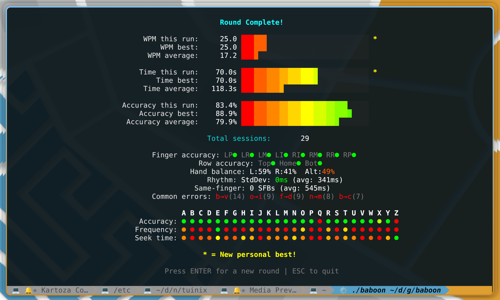
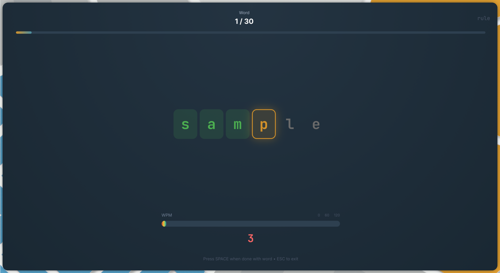

<p align="center">
  
</p>

<h1 align="center">Baboon</h1>

<p align="center">
  <strong>Master your typing with beautiful practice</strong>
</p>

<p align="center">
  <a href="https://github.com/timlinux/baboon/actions/workflows/build.yml"></a>
  <a href="https://github.com/timlinux/baboon/actions/workflows/test.yml"></a>
  <a href="https://github.com/timlinux/baboon/releases/latest"></a>
  <a href="https://github.com/timlinux/baboon/blob/main/LICENSE"></a>
</p>

<p align="center">
  
  
  
  
</p>

<p align="center">
  <a href="#features">Features</a> •
  <a href="#screenshots">Screenshots</a> •
  <a href="#installation">Installation</a> •
  <a href="#usage">Usage</a> •
  <a href="#statistics">Statistics</a> •
  <a href="#support-baboon">Support</a>
</p>

---

<div align="center">

### **Love Baboon? Support its development!**

Baboon is **free and open source**, built with love during nights and weekends.
Your support keeps the project alive and growing!

<a href="https://github.com/sponsors/timlinux">
  
</a>
<a href="https://ko-fi.com/timlinux">
  
</a>
<a href="https://kartoza.com/donate">
  
</a>

**Suggested donation: €10 / $10** - *Less than a coffee a month, helps a developer for a day!*

</div>

---

Baboon is a cross-platform typing practice application built with Go. It helps users improve their typing speed and accuracy by presenting common English words in large block letter format with real-time visual feedback.

## Features

- **Two Beautiful Interfaces**
  - **Terminal UI (TUI)**: Built with Bubble Tea and Lipgloss, displaying words using Unicode block characters
  - **Web UI**: Built with React and Chakra UI, featuring physics-based animations with Framer Motion

- **Intelligent Practice**
  - Adaptive word selection based on your accuracy patterns
  - Prioritises words containing letters you frequently mistype
  - 30-word rounds with exactly 150 characters for consistent comparison

- **Real-time Feedback**
  - Characters change colour as you type (green for correct, red for incorrect)
  - Live WPM bar with gradient colouring during typing
  - Spring-based animations for satisfying visual feedback

- **Comprehensive Statistics**
  - Per-letter accuracy and speed tracking
  - Finger-specific performance analysis
  - Hand balance and alternation tracking
  - Common error pattern detection
  - Historical best comparison with personal records

- **Cross-Platform**
  - Native binaries for Linux, macOS, and Windows
  - Reproducible builds with Nix flakes
  - Multiple package formats (DEB, RPM, Flatpak)

## Screenshots

### Terminal Interface

<p align="center">
  
  <br>
  <em>Large block letters with real-time colour feedback and WPM bar</em>
</p>

<p align="center">
  
  <br>
  <em>Detailed statistics with per-letter accuracy heatmap</em>
</p>

### Web Interface

<p align="center">
  
  <br>
  <em>Physics-based animations with chunky letter blocks</em>
</p>

<p align="center">
  
  <br>
  <em>Beautiful dashboard with keyboard heatmaps and typing analysis</em>
</p>

## Installation

### Pre-built Binaries

Download the latest release for your platform from the [Releases](https://github.com/timlinux/baboon/releases) page:

| Platform | Package |
|----------|---------|
| Linux | `baboon-linux-amd64` (binary), `.deb`, `.rpm`, `.flatpak` |
| macOS | `baboon-darwin-amd64`, `baboon-darwin-arm64` |
| Windows | `baboon-windows-amd64.exe` |

### macOS: Running Unsigned Binaries

The macOS binaries are not signed with an Apple Developer certificate. When you first try to run the binary, macOS will block it with a security warning. To allow it to run:

**Option 1: Remove quarantine attribute (recommended)**
```bash
# After downloading, remove the quarantine flag
xattr -d com.apple.quarantine baboon-darwin-amd64

# Make it executable and run
chmod +x baboon-darwin-amd64
./baboon-darwin-amd64
```

**Option 2: Allow via System Settings**
1. Try to run the binary - it will be blocked
2. Open **System Settings** → **Privacy & Security**
3. Scroll down to find the blocked app message
4. Click **"Allow Anyway"**
5. Run the binary again and click **"Open"** when prompted

**Option 3: Right-click to open**
1. Right-click (or Control-click) the binary in Finder
2. Select **"Open"** from the context menu
3. Click **"Open"** in the dialog that appears

> **Note**: These steps are only needed once per binary. After allowing the app, it will run normally.

### Using Nix Flakes

```bash
# Run directly
nix run github:timlinux/baboon

# Or install to your profile
nix profile install github:timlinux/baboon
```

### From Source

```bash
git clone https://github.com/timlinux/baboon.git
cd baboon
go build -o baboon .
./baboon
```

## Usage

### Console Mode (Default)

```bash
# Start with integrated backend
./baboon

# With punctuation practice
./baboon -p

# Custom port
./baboon -port 9000
```

### Server/Client Mode

```bash
# Start backend server only
./baboon -server

# Connect client to running server
./baboon -client
```

### Web Interface

```bash
# Start backend + web frontend
make web-start

# Or manually:
./baboon -server &
cd web && npm start
```

Then open http://localhost:3000 in your browser.

### How to Play

1. **Start typing** - The timer begins when you type the first correct character
2. **Watch the colours** - Green means correct, red means incorrect
3. **Press SPACE** - Move to the next word when you've typed all letters
4. **Complete 30 words** - View your statistics and try to beat your records
5. **Press ENTER** - Start a new round
6. **Press ESC** - Quit at any time

## Statistics

Baboon tracks comprehensive typing metrics:

| Metric | Description |
|--------|-------------|
| **WPM** | Words per minute (correct characters / 5 / minutes) |
| **Accuracy** | Percentage of correct keystrokes |
| **Time** | Round completion time |
| **Letter Accuracy** | Per-letter performance heatmap |
| **Letter Speed** | Average seek time per letter |
| **Finger Accuracy** | Performance by finger (touch typing layout) |
| **Hand Balance** | Left vs right hand usage distribution |
| **Alternation Rate** | How often you alternate between hands |
| **Common Errors** | Most frequent letter substitutions |

Statistics are saved to `~/.config/baboon/stats.json` and persist between sessions.

## Development

### Prerequisites

- Go 1.21+
- Node.js 18+ (for web frontend)
- Nix (optional, for reproducible builds)

### Building

```bash
# Enter development shell (with Nix)
nix develop

# Build binary
make build

# Run tests
make test

# Format code
make fmt
```

### Web Frontend

```bash
# Install dependencies
make web-install

# Start development server
make web-dev

# Build for production
make web-build
```

### Project Structure

```
baboon/
├── main.go              # Entry point
├── backend/             # Game engine and REST API
├── frontend/            # Terminal UI (Bubble Tea)
├── web/                 # React web frontend
├── font/                # Block letter font definitions
├── words/               # British English word dictionary
├── stats/               # Statistics and persistence
└── scripts/             # Management scripts
```

## Technology

- **Backend**: Go with REST API architecture
- **TUI**: [Bubble Tea](https://github.com/charmbracelet/bubbletea) + [Lipgloss](https://github.com/charmbracelet/lipgloss)
- **Web**: React 18 + [Chakra UI](https://chakra-ui.com/) + [Framer Motion](https://www.framer.com/motion/)
- **Animations**: [Harmonica](https://github.com/charmbracelet/harmonica) spring physics

## Acknowledgements

- Built with the excellent [Charm](https://charm.sh/) libraries
- British English spelling throughout
- Kartoza brand colours in web interface

## Support Baboon

<div align="center">

### **Baboon saved you hours? Return the favour!**

This project represents **hundreds of hours** of development, testing, and refinement.
If Baboon has helped improve your typing skills, consider supporting its creator.

| What Your Support Provides | |
|---|---|
| Ongoing maintenance & bug fixes | |
| New features & improvements | |
| Server costs & infrastructure | |
| Coffee to fuel late-night coding | |

<br>

<a href="https://github.com/sponsors/timlinux">
  
</a>

<br><br>

<a href="https://ko-fi.com/timlinux">
  
</a>
&nbsp;&nbsp;
<a href="https://kartoza.com/donate">
  
</a>

<br><br>

### **Suggested: €10 / $10**

*That's less than two coffees - but it makes a real difference!*

Every contribution, no matter how small, is deeply appreciated and helps keep Baboon free for everyone.

**Thank you for being awesome!**

</div>

---

## License

MIT License - see [LICENSE](LICENSE) for details.

---

<p align="center">
  Made with love for typists everywhere<br>
  <sub>If you love it too, <a href="https://github.com/sponsors/timlinux">show some support</a></sub>
</p>
