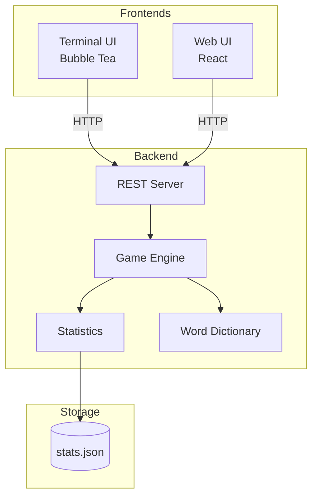
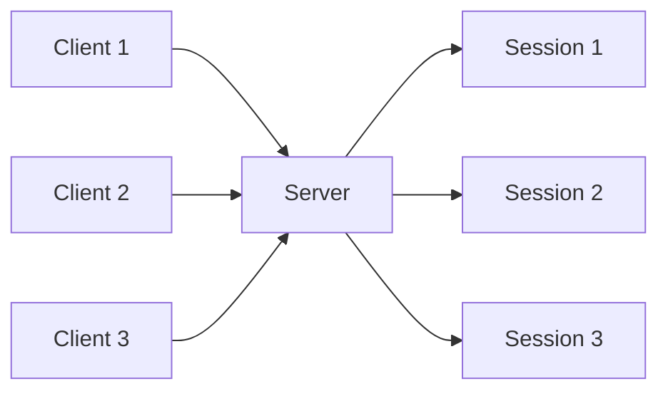
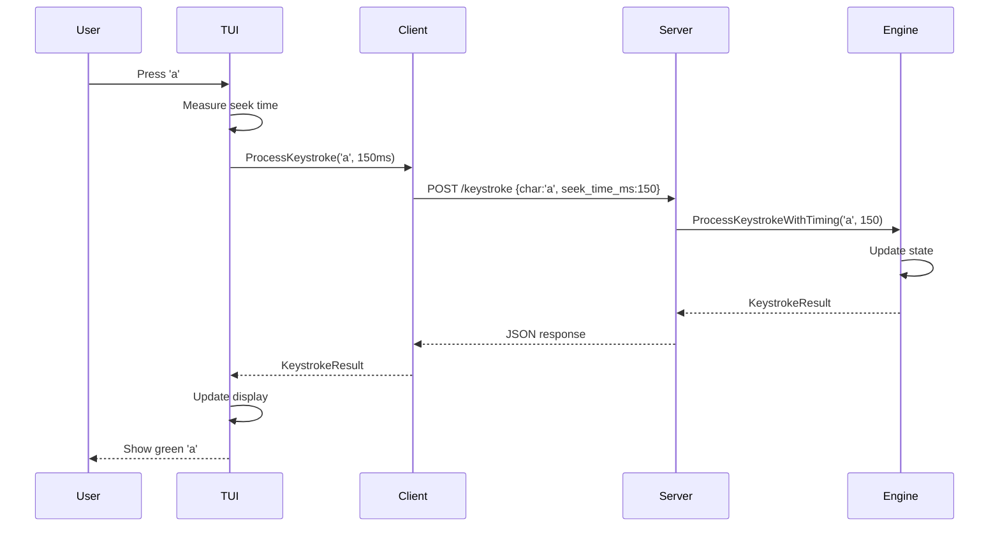

# Architecture

Baboon follows a clean architecture with clear separation between backend and frontend components.

## High-Level Overview



## Backend Package

Located in `backend/`, the backend handles all game logic.

### GameAPI Interface

```go
type GameAPI interface {
    // Game Lifecycle
    StartRound()

    // Input Handling
    ProcessKeystroke(char string) KeystrokeResult
    ProcessBackspace() bool
    ProcessSpace() SpaceResult

    // State Queries
    GetGameState() GameState
    GetSessionStats() *stats.Stats
    GetHistoricalStats() *stats.HistoricalStats

    // Persistence
    SaveStats() error
}
```

This interface defines all operations the frontend can perform.

### Game Engine (`engine.go`)

The engine implements `GameAPI`:

- Manages game state (current word, input, timer)
- Processes keystrokes
- Calculates statistics
- Handles word selection

### REST Server (`server.go`)

HTTP server exposing the game engine:

```
POST /api/sessions              Create session
DELETE /api/sessions/{id}       Delete session
GET /api/sessions/{id}/state    Get game state
POST /api/sessions/{id}/round   Start round
POST /api/sessions/{id}/keystroke   Process keystroke
POST /api/sessions/{id}/space   Process space
POST /api/sessions/{id}/timing  Submit timing data
```

### Session Management

Multiple clients can connect simultaneously:



Each session has:

- Unique 32-character hex ID
- Independent game state
- Shared statistics file

## Frontend Package

Located in `frontend/`, the terminal UI handles rendering and input.

### Model (`model.go`)

Bubble Tea model with:

- Game state caching
- Local timing tracking
- Animation state
- Window dimensions

### Views (`views.go`)

Rendering functions:

- `RenderTypingScreen()` - Main typing display
- `RenderResultsScreen()` - Statistics display
- `RenderWPMBar()` - Live speed indicator
- `RenderLetterStats()` - Letter accuracy matrix

### Styles (`styles.go`)

Lipgloss style definitions:

- Colour codes (correct, incorrect, untyped)
- Layout styles
- Gradient colours

### Animations (`animations.go`)

Harmonica spring animations:

- Word carousel transitions
- Results screen slide-in
- Staggered timing

### REST Client (`client.go`)

Implements `GameAPI` via HTTP:

- Sends requests to backend
- Parses responses
- Handles timing data submission

## Statistics Package

Located in `stats/`, handles all statistics.

### Types (`stats.go`)

```go
type HistoricalStats struct {
    BestWPM        float64
    BestAccuracy   float64
    BestTime       float64
    TotalWPM       float64
    TotalAccuracy  float64
    TotalTime      float64
    TotalSessions  int
    LetterAccuracy map[string]*LetterStats
    FingerStats    map[int]*FingerStats
    // ... more fields
}
```

### Persistence

Statistics saved to `~/.config/baboon/stats.json`:

- Automatic directory creation
- JSON marshalling
- Corruption detection and repair

### Keyboard Mappings (`keyboard.go`)

QWERTY layout mappings:

- Letter → Finger
- Letter → Hand
- Letter → Row

## Font Package

Located in `font/`, defines block letter rendering.

### Character Definitions

Each letter is a 6-line string array:

```go
var Letters = map[rune][]string{
    'a': {
        "  ▄▄▄  ",
        " █   █ ",
        " █████ ",
        " █   █ ",
        " █   █ ",
        "       ",
    },
    // ... more letters
}
```

### Rendering

`RenderWord(word string) string` joins letters horizontally.

## Words Package

Located in `words/`, contains the word dictionary.

### Dictionary

~1000 common British English words:

- Lowercase only
- Varying lengths (3-10+ characters)
- No proper nouns

### Selection Algorithm

Adaptive word selection:

1. Score each letter based on frequency and accuracy
2. Score each word as average of letter scores
3. Weighted random selection favouring high scores
4. Constraint satisfaction (30 words, 150 characters)

## Data Flow

### Typing a Character



### Frontend Timing

All timing-critical measurements happen on the frontend:

1. **Timer start**: First correct keystroke timestamp
2. **Seek times**: Measured between keystrokes
3. **Round duration**: Calculated from start to end

This eliminates network latency from affecting statistics.

## Configuration

### Command Line Flags

| Flag | Description | Default |
|------|-------------|---------|
| `-p` | Punctuation mode | false |
| `-port` | Server port | 8787 |
| `-server` | Server-only mode | false |
| `-client` | Client-only mode | false |

### File Locations

| File | Location |
|------|----------|
| Statistics | `~/.config/baboon/stats.json` |
| PID file | `$XDG_RUNTIME_DIR/baboon.pid` |
| Log file | `$XDG_RUNTIME_DIR/baboon.log` |

## Web Frontend Architecture

### Component Hierarchy

```
App
├── WelcomeScreen
│   └── Connection status
├── TypingScreen
│   ├── WordCarousel
│   ├── BlockLetters
│   └── WPMBar
└── ResultsScreen
    ├── StatCards
    ├── LetterHeatmap
    └── FingerDisplay
```

### State Management

React hooks for state:

- `useState` for local state
- Context for shared state
- Custom hooks for API calls

### API Communication

`api.js` module:

```javascript
export const createSession = () =>
  fetch('/api/sessions', { method: 'POST' })

export const processKeystroke = (sessionId, char, seekTime) =>
  fetch(`/api/sessions/${sessionId}/keystroke`, {
    method: 'POST',
    body: JSON.stringify({ char, seek_time_ms: seekTime })
  })
```

## Build System

### Go Build

```bash
go build -o baboon .
```

### Cross-Compilation

```bash
GOOS=darwin GOARCH=arm64 go build -o baboon-darwin-arm64 .
GOOS=windows GOARCH=amd64 go build -o baboon-windows-amd64.exe .
```

### Nix Flake

Reproducible builds:

```bash
nix build
nix run
```

## Testing

### Unit Tests

```bash
go test ./...
```

### Package Tests

- `stats/stats_test.go` - Statistics calculations
- Integration tests in progress

## Next Steps

- [API Reference](api.md) - Full API documentation
- [Building](building.md) - Build instructions
- [Contributing](contributing.md) - How to contribute
