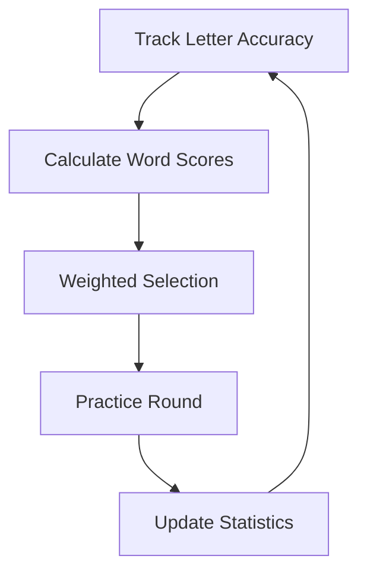

# Adaptive Learning

One of Baboon's most powerful features is its adaptive word selection algorithm. Unlike random word generators, Baboon learns from your mistakes and targets your weak spots.

## How It Works



## The Scoring Algorithm

Every word is scored based on how helpful it would be for your practice. Higher scores mean the word will appear more often.

### Word Score Calculation

For each word, Baboon:

1. Examines every letter in the word
2. Calculates a score for each letter
3. Averages the letter scores to get the word score

### Letter Score Components

Each letter has two scoring factors:

#### 1. Frequency Score

**Formula**: `frequency_score = 1 - (letter_presented / max_letter_presented)`

- Letters you've seen less often score higher
- Ensures all letters get coverage
- Prevents over-practicing common letters

**Example**:

| Letter | Times Presented | Max Presented | Score |
|--------|-----------------|---------------|-------|
| e | 500 | 500 | 0.0 |
| z | 50 | 500 | 0.9 |
| q | 25 | 500 | 0.95 |

#### 2. Accuracy Score

**Formula**: `accuracy_score = 1 - (letter_correct / letter_presented)`

- Letters you mistype often score higher
- Targets your actual weak spots
- Adapts as you improve

**Example**:

| Letter | Correct | Presented | Score |
|--------|---------|-----------|-------|
| a | 95 | 100 | 0.05 |
| r | 80 | 100 | 0.20 |
| z | 60 | 100 | 0.40 |

#### Combined Score

**Formula**: `letter_score = (frequency_score + accuracy_score) / 2`

| Letter | Frequency | Accuracy | Combined |
|--------|-----------|----------|----------|
| e | 0.0 | 0.05 | 0.025 |
| z | 0.9 | 0.40 | 0.65 |
| q | 0.95 | 0.20 | 0.575 |

### Word Score

**Formula**: `word_score = average(letter_scores)`

A word like "quiz" with uncommon and error-prone letters will score much higher than "the" with common, well-practiced letters.

## Selection Process

### Weighted Random Selection

Words aren't selected purely by highest score. Instead, scores become **selection probabilities**:

1. All words are assigned their calculated scores
2. Words are randomly selected, weighted by score
3. Higher scores = higher probability, not guaranteed selection

This maintains variety while biasing toward helpful words.

### Round Constraints

Each round must meet exact requirements:

- **30 words** exactly
- **150 characters** total

The selection algorithm:

1. Calculates ideal word length based on remaining characters and words
2. Allows variance of ±2 characters to maintain variety
3. Retries up to 100 times if constraints can't be met

## Frequency Balancing Goal

Baboon aims for all letters to be presented within **10% spread** from highest to lowest:

| Metric | Target |
|--------|--------|
| Most presented letter | ~120 times |
| Least presented letter | ~108 times |
| Variance | < 10% |

Over time, this ensures comprehensive practice across the entire alphabet.

## Practical Effects

### Early Sessions

When you first start:

- All letters have equal frequency scores
- All letters have equal accuracy scores
- Word selection is essentially random

### After 10 Sessions

Patterns emerge:

- Frequently mistyped letters get more practice
- Rare letters start appearing more often
- Your word selection becomes personalised

### After 50+ Sessions

Strong adaptation:

- Weak letters are consistently targeted
- Strong letters appear less often
- Practice is highly efficient

## Example: Real Adaptation

Let's say you consistently struggle with 'r' and 'u':

**Before adaptation**:
```
session 1: about, change, would, simple, often
session 2: other, while, could, place, great
```

**After adaptation**:
```
session 10: structure, return, urge, curious, rural
session 11: current, future, nature, require, urban
```

Notice how words with 'r' and 'u' appear more frequently!

## Viewing Your Data

Check your letter statistics to see what Baboon is targeting:

1. Complete a round
2. View the results screen
3. Check the letter accuracy heatmap
4. Red/orange letters are being prioritised

## Resetting Adaptation

To start fresh, delete your statistics file:

```bash
rm ~/.config/baboon/stats.json
```

!!! warning
    This removes ALL your historical data, including personal bests!

## Tips for Best Results

### Let It Learn

- Complete at least 10 sessions before judging adaptation
- Don't rush through sessions - accuracy matters for learning
- Practice regularly for consistent data collection

### Focus on Accuracy

- The algorithm rewards correct typing
- Rushing creates more errors = more of those letters
- Slow, accurate typing improves faster

### Trust the Process

- If a letter keeps appearing, you need the practice
- Improvement will eventually reduce its frequency
- The system is working even when it feels repetitive

## Technical Details

### Data Storage

Letter statistics are stored in `stats.json`:

```json
{
  "letter_accuracy": {
    "a": {"presented": 150, "correct": 145},
    "b": {"presented": 45, "correct": 40},
    "z": {"presented": 12, "correct": 10}
  }
}
```

### Algorithm Location

The adaptive selection logic is implemented in:

- `backend/engine.go` - Word selection
- `stats/stats.go` - Letter tracking

### Punctuation Mode

In punctuation mode (`-p` flag):

- Letter accuracy only tracks a-z
- Punctuation is not factored into adaptation
- Word selection still uses letter-based scoring

## Next Steps

- [Statistics](statistics.md) - Understanding all your metrics
- [Improving Speed](../guide/improving-speed.md) - Using adaptation effectively
- [Architecture](../development/architecture.md) - Technical implementation details
