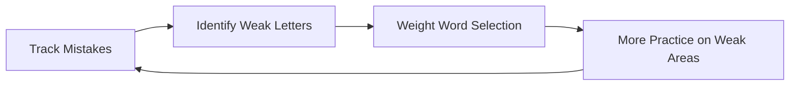
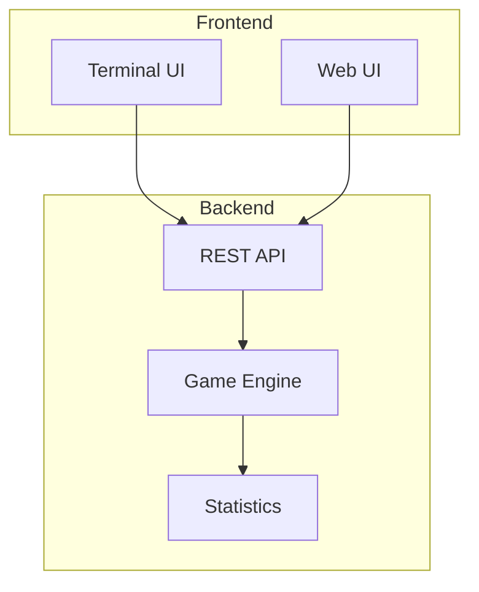

# Features Overview

Baboon is packed with features designed to make you a better typist. Here's what sets it apart from other typing tutors.

## Dual Interface Design

<div class="feature-grid">
  <div class="feature-card">
    <h3>:material-console: Terminal UI</h3>
    <p>A beautiful TUI built with Bubble Tea and Lipgloss. Unicode block characters create stunning large letters that change colour as you type.</p>
    <ul>
      <li>Works over SSH</li>
      <li>No browser needed</li>
      <li>Minimal resource usage</li>
      <li>Spring-based animations</li>
    </ul>
  </div>
  <div class="feature-card">
    <h3>:material-web: Web UI</h3>
    <p>A modern React application with Chakra UI and Framer Motion. Physics-based animations make typing feel satisfying.</p>
    <ul>
      <li>Works on any device</li>
      <li>Touch-friendly</li>
      <li>Responsive design</li>
      <li>Chunky button aesthetics</li>
    </ul>
  </div>
</div>

## Intelligent Word Selection

Baboon doesn't just throw random words at you. It uses a sophisticated algorithm to maximise your learning:

### Adaptive Learning



- **Frequency balancing**: Ensures all letters get coverage
- **Accuracy weighting**: Prioritises letters you frequently mistype
- **Combined scoring**: Words are ranked by how helpful they'll be

### Consistent Rounds

Every round contains:

- Exactly **30 words**
- Exactly **150 characters**

This ensures your WPM scores are always comparable across sessions.

## Real-time Visual Feedback

### Colour-coded Letters

| Colour | Meaning |
|--------|---------|
| <span class="key">Gray</span> | Not yet typed |
| <span class="key correct">Green</span> | Correctly typed |
| <span class="key incorrect">Red</span> | Incorrectly typed |

Letters change colour **instantly** - no lag, no delay.

### Live WPM Bar

A gradient progress bar shows your current speed:

```
▂▂▂▂▂▂▂▂▂▂▂▂▂▂▂▂░░░░░░░░░░░░░░░░  45 WPM
```

Colours indicate performance:

- :material-circle:{ style="color: #E53935" } **Red**: Below 40 WPM
- :material-circle:{ style="color: #FFC107" } **Yellow**: 40-60 WPM
- :material-circle:{ style="color: #4CAF50" } **Green**: Above 60 WPM

### Word Carousel

See what's coming next:

- Previous word (dimmed, above)
- Current word (bright, center)
- Next 3 words (dimmed, below)

Smooth spring animations when transitioning between words.

## Comprehensive Statistics

Baboon tracks more than just WPM:

### Core Metrics

| Metric | Description |
|--------|-------------|
| **WPM** | Words per minute (correct chars / 5 / minutes) |
| **Accuracy** | Correct keystrokes as a percentage |
| **Time** | Round completion duration |

### Per-Letter Analysis

- **Accuracy**: How often you hit each letter correctly
- **Frequency**: How often each letter appears
- **Seek time**: How fast you reach each letter

### Typing Theory Metrics

- **Finger accuracy**: Performance by finger (8 fingers)
- **Row accuracy**: Top/Home/Bottom row performance
- **Hand balance**: Left vs right distribution
- **Alternation rate**: Hand-switching frequency
- **Same-finger bigrams**: Slow letter pairs detected
- **Rhythm consistency**: Typing evenness (std deviation)
- **Error patterns**: Common letter substitutions

## Persistence

All statistics are saved to `~/.config/baboon/stats.json`:

- Survives between sessions
- Tracks historical bests
- Maintains running averages
- Records per-letter stats

## Cross-Platform Support

| Platform | Support |
|----------|---------|
| :fontawesome-brands-linux: Linux | AMD64, ARM64 |
| :fontawesome-brands-apple: macOS | Intel, Apple Silicon |
| :fontawesome-brands-windows: Windows | AMD64 |

### Package Formats

- Native binaries
- DEB packages (Debian/Ubuntu)
- RPM packages (Fedora/RHEL)
- Flatpak
- Nix flakes

## British English

Baboon uses proper British spellings throughout:

- colour (not color)
- behaviour (not behavior)
- organisation (not organization)
- travelling (not traveling)

## Punctuation Mode

Enable punctuation practice with the `-p` flag:

```bash
baboon -p
```

Words are separated by random punctuation: `, . ; : ! ?`

## Architecture

### Client-Server Design



- Frontend handles all timing-critical measurements
- Backend manages game logic and persistence
- Multiple clients can connect to one server

### Technology Stack

| Component | Technology |
|-----------|------------|
| Backend | Go |
| TUI | Bubble Tea, Lipgloss, Harmonica |
| Web | React 18, Chakra UI, Framer Motion |
| Animations | Spring physics (Harmonica) |
| Build | Nix flakes |

## What's Next?

Explore each feature in detail:

- [Terminal Interface](terminal.md)
- [Web Interface](web.md)
- [Statistics Deep Dive](statistics.md)
- [Adaptive Learning](adaptive.md)
