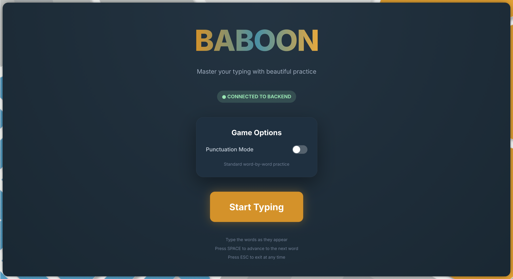
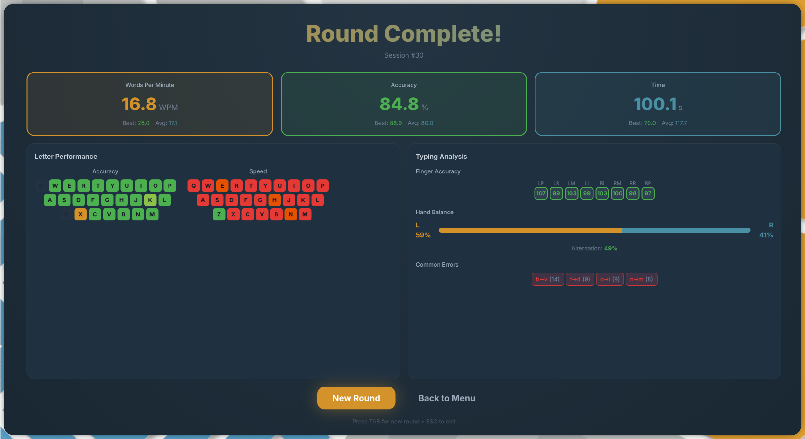

# Web Interface

The Web UI brings Baboon to your browser with physics-based animations and a beautiful dark theme.


## Technology Stack

- **[React 18](https://react.dev/)** - Modern React with hooks
- **[Chakra UI 2.x](https://chakra-ui.com/)** - Component library with dark theme
- **[Framer Motion](https://www.framer.com/motion/)** - Physics-based animations
- **Custom Theme** - Kartoza brand colours

## Design Philosophy

The web UI prioritises:

1. **Satisfying feedback** - Every keypress feels good
2. **Visual clarity** - Large, readable letters
3. **Smooth animations** - Physics-based, not jarring
4. **Dark theme** - Easy on the eyes

## Kartoza Brand Colours

The web interface uses Kartoza's brand colour scheme:

| Colour | Hex | Usage |
|--------|-----|-------|
| Kartoza Orange | `#D4922A` | Primary - buttons, highlights, WPM |
| Kartoza Blue | `#4A90A4` | Secondary - hover states, time stats |
| Background Primary | `#1a2833` | Main background |
| Background Secondary | `#243442` | Card backgrounds |
| Green | `#4CAF50` | Correct keystrokes |
| Red | `#E53935` | Incorrect keystrokes |

## Screens

### Welcome Screen

The landing page features:

- Animated Baboon logo
- Connection status indicator
- Game options:
  - Start Practice (normal mode)
  - Punctuation Mode
- Gradient title text



### Typing Screen

During typing, you'll see:

- **Block letters** with spring-bounce animations
- **Word carousel** with blur effects on adjacent words
- **Progress indicator** showing word count
- **Live WPM bar** with gradient colouring
- **Decorative glow** behind the current word

Letters respond to keystrokes with:

- Scale bounce on correct press
- Shake animation on errors
- Colour transitions

### Results Screen



The results display includes:

- **Animated stat cards** - Slide in with staggered spring animations
- **Progress bars** - Smooth fill animations
- **Letter statistics grid** - Colour-coded accuracy indicators
- **Finger accuracy display** - Visual finger mapping
- **Hand balance stats** - Left/right distribution
- **Error patterns** - Most common mistakes

## Physics Animations

All animations use Framer Motion spring dynamics:

```javascript
// Example spring configuration
{
  type: "spring",
  stiffness: 300,
  damping: 20
}
```

### Letter Bounce

When you type a correct letter:

1. Letter scales up to 1.1x
2. Springs back to 1.0x
3. Colour transitions to green

### Error Shake

On mistakes:

1. Letter shakes horizontally
2. Transitions to red
3. Returns to rest position

### Stat Cards

Results screen cards:

1. Start off-screen (right)
2. Slide in with stagger timing
3. Spring into final position

## Running the Web UI

### Quick Start

```bash
make web-start
```

This starts both the backend server and the React development server.

### Manual Start

```bash
# Terminal 1: Start backend
./baboon -server

# Terminal 2: Start web frontend
cd web
npm install  # First time only
npm start
```

Open http://localhost:3000 in your browser.

### Production Build

```bash
make web-build
```

Creates an optimised build in `web/build/`.

## Proxy Configuration

The development server proxies API requests:

- Frontend: `http://localhost:3000`
- Backend: `http://127.0.0.1:8787`
- Proxy path: `/api/*`

## Browser Support

Recommended browsers:

- Chrome/Chromium 90+
- Firefox 88+
- Safari 14+
- Edge 90+

Required features:

- ES6+ JavaScript
- CSS Grid and Flexbox
- CSS Custom Properties
- Web Fonts (Inter, JetBrains Mono)

## Responsive Design

The web UI adapts to different screen sizes:

| Breakpoint | Layout |
|------------|--------|
| Desktop (>1024px) | Full layout |
| Tablet (768-1024px) | Reduced margins |
| Mobile (<768px) | Stacked layout |

!!! note
    While the web UI works on mobile, typing practice is best experienced with a physical keyboard.

## Custom Theme

The Chakra UI theme includes custom button variants:

### Glow Variant

```jsx
<Button variant="glow">Start Practice</Button>
```

Orange button with subtle glow effect.

### Chunky Variant

```jsx
<Button variant="chunky">Punctuation Mode</Button>
```

Larger, more prominent button style.

## Development

### File Structure

```
web/
├── package.json
├── public/
│   └── index.html
└── src/
    ├── index.js         # Entry point
    ├── App.js           # Main component
    ├── api.js           # REST client
    ├── theme.js         # Chakra theme
    └── components/
        ├── WelcomeScreen.js
        ├── TypingScreen.js
        └── ResultsScreen.js
```

### Available Scripts

| Command | Description |
|---------|-------------|
| `npm start` | Start dev server |
| `npm build` | Production build |
| `npm test` | Run tests |
| `npm eject` | Eject from CRA |

## Comparison: TUI vs Web

| Feature | Terminal UI | Web UI |
|---------|-------------|--------|
| Platform | Terminal | Browser |
| Animation | Harmonica springs | Framer Motion |
| Styling | Lipgloss | Chakra UI |
| Block letters | Unicode characters | SVG/CSS |
| Offline | Yes | Needs backend |
| Touch input | No | Yes |

## Next Steps

- [Terminal Interface](terminal.md) - Try the TUI
- [Statistics](statistics.md) - Understanding your results
- [Improving Speed](../guide/improving-speed.md) - Tips to type faster
