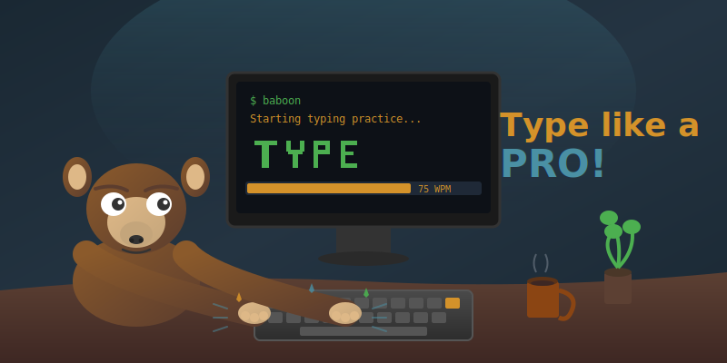

# Welcome to Baboon

  

**Baboon** is a cross-platform typing practice application that helps you become a keyboard warrior! Built with Go and featuring both a gorgeous terminal interface and a modern web UI, Baboon makes improving your typing skills actually fun.

  

    
:fontawesome-solid-keyboard:

    <h3>Beautiful Interfaces</h3>
    
Choose between a stunning Terminal UI with Unicode block letters or a sleek Web UI with physics-based animations.

  

  

    
:fontawesome-solid-brain:

    <h3>Adaptive Learning</h3>
    
Baboon learns your weak spots and prioritises words with letters you frequently mistype.

  

  

    
:fontawesome-solid-chart-line:

    <h3>Deep Statistics</h3>
    
Track per-letter accuracy, finger performance, hand balance, and see where you need to improve.

  

  

    
:fontawesome-solid-bolt:

    <h3>Real-time Feedback</h3>
    
Instant colour feedback as you type - green for correct, red for mistakes. No guessing!

  

## Quick Start

Get typing in seconds:

  

    
    
    
  

  

    $ nix run github:timlinux/baboon 
    Starting Baboon typing practice... 
    Ready! Start typing to begin.
  

Or download a binary from the [releases page](https://github.com/timlinux/baboon/releases).

## See It In Action

  <figure class="screenshot-item">
    
    <figcaption>Large block letters with real-time colour feedback</figcaption>
  </figure>
  <figure class="screenshot-item">
    
    <figcaption>Modern web interface with physics animations</figcaption>
  </figure>

## Why Baboon?

!!! baboon-tip "Why the name?"
    Baboons are known for their dexterity and quick fingers - perfect inspiration for a typing tutor! Plus, our mascot is absolutely adorable while hammering away at the keyboard.

- **30 words per round** - Each round has exactly 150 characters for fair WPM comparisons
- **British English** - Proper spellings like "colour" and "behaviour"
- **Cross-platform** - Works on Linux, macOS, and Windows
- **Nix-ready** - Reproducible builds with Nix flakes
- **Open source** - MIT licensed, hack away!

## What Our Users Say

My typing speed went from 45 WPM to 75 WPM in just two weeks of daily practice with Baboon. The per-letter accuracy tracking helped me identify that my ring fingers were slowing me down!

## Ready to Start?

  

    <h3>:material-download: Download</h3>
    
Grab a pre-built binary for your platform from our releases page.

    <a href="getting-started/installation/">Installation Guide →</a>
  

  

    <h3>:material-play-circle: Try Now</h3>
    
Jump straight in with our quick start guide.

    <a href="getting-started/quick-start/">Quick Start →</a>
  

---

  Made with :fontawesome-solid-heart:{ .heart } for typists everywhere

